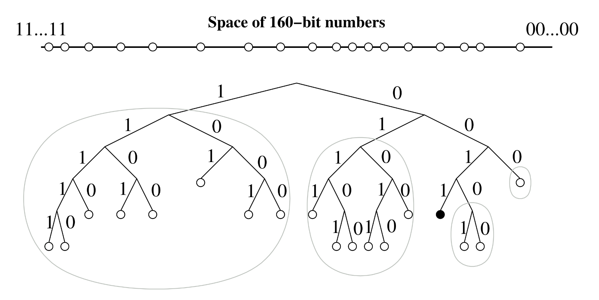
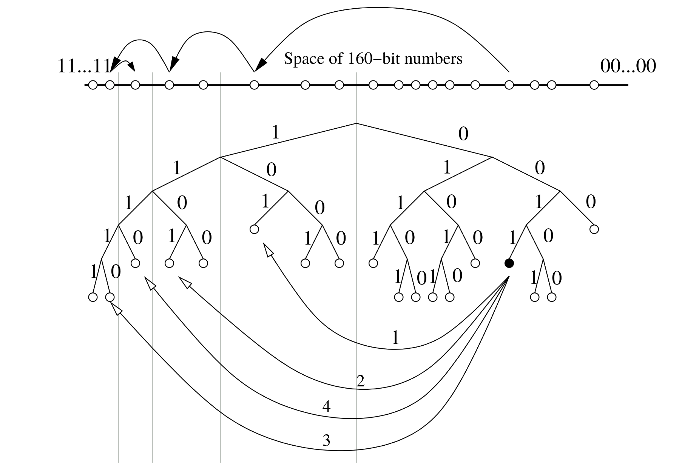
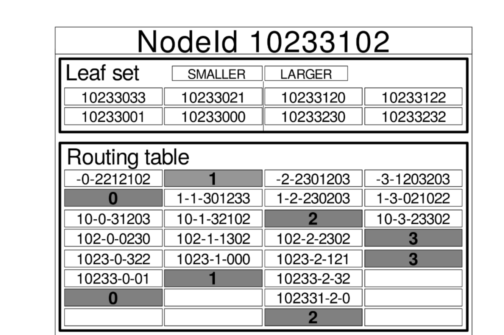
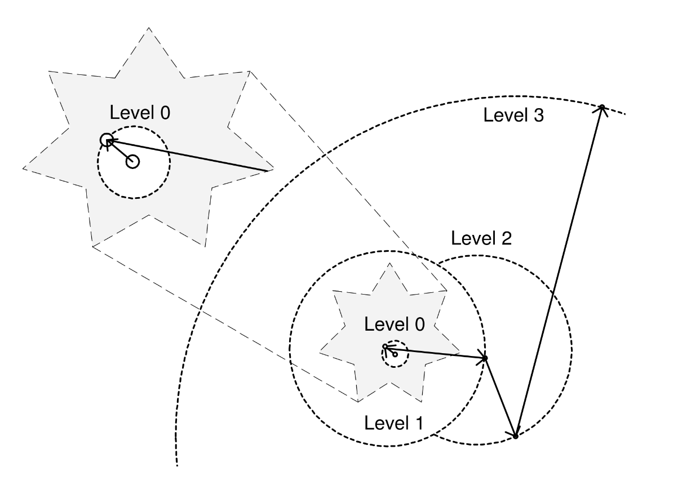
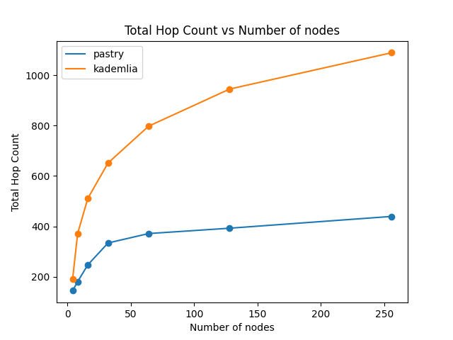
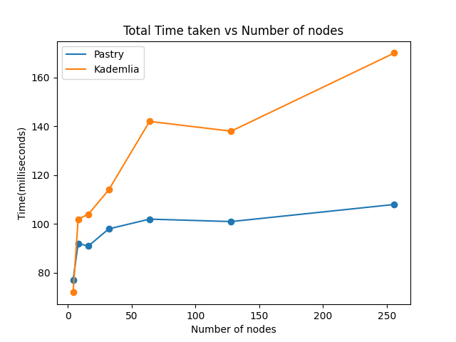
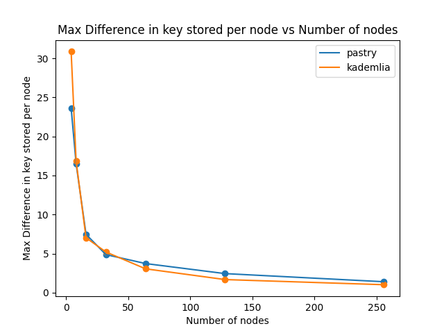

<!-- { width=50% } -->

# Table of Contents

- [Table of Contents](#table-of-contents)
- [Introduction](#introduction)
  - [What is **Distributed Hashing?**](#what-is-distributed-hashing)
  - [A brief overview of how DHTs work](#a-brief-overview-of-how-dhts-work)
  - [Kademlia](#kademlia)
  - [Pastry](#pastry)
- [Report](#report)
  - [Problem Statement](#problem-statement)
  - [Approach](#approach)
  - [Implementation](#implementation)
  - [Evaluation](#evaluation)
    - [Graphs](#graphs)
      - [Number of Hops](#number-of-hops)
      - [Total Time Taken](#total-time-taken)
      - [Load Balancing](#load-balancing)
- [Conclusion](#conclusion)
- [Reference](#reference)

\newpage

# Introduction

## What is **Distributed Hashing?**

Distributed hashing is a method employed in distributed computing setups for the effective storage and retrieval of data across numerous nodes within a network. This approach integrates hashing principles, which entail assigning data to a fixed-size value, with distribution, wherein data is dispersed across various nodes or machines.

Here's how it typically works:

1. **Hashing**: The data undergoes hashing via a hash function, producing a distinct identifier (hash) for each data fragment. This hash functions as the pivotal element for both storing and retrieving the data.

2. **Distribution**: The hashed data is transmitted to one of the nodes within the network based on the hash value. The node responsible for storing the data is determined by the hash value, ensuring that the data is evenly distributed across the network.

Distributed hashing is used in various distributed systems and applications for several reasons:

1. **Scalability**: This facilitates horizontal scaling of systems by incorporating more nodes into the network. With an increase in data volume or workload, additional nodes can be introduced to manage the load seamlessly, preserving the overall performance.

2. **Fault Tolerance**: Distributed hashing ensures fault tolerance by duplicating data across multiple nodes. In the event of a node failure or unavailability, the data remains accessible from other nodes, guaranteeing high availability and reliability.

3. **Load Balancing**: Distributed hashing contributes to evenly balancing the workload across the network by dispersing data among multiple nodes. This prevents any single node from becoming a bottleneck and ensures optimal performance.

Distributed hashing finds application across diverse distributed systems and platforms, encompassing distributed databases, content delivery networks (CDNs), peer-to-peer (P2P) networks, and distributed file systems such as Hadoop Distributed File System (HDFS) and Amazon S3.

\newpage

## A brief overview of how DHTs work

There are several distributed hash table (DHT) algorithms that implement distributed hashing, each with its own unique approach to storing and retrieving data in a decentralized network. However, most DHT algorithms share some common characteristics:

1. **Key-based Routing**: DHTs use a key-based routing mechanism to route messages between nodes in the network. Each node is assigned a unique identifier (ID) based on a hash of its IP address or some other identifier. When a node wants to find a specific piece of data, it uses the key's hash value to route the request to the node responsible for storing that data.
2. **Overlay Network**: Each node in the network is connected to a subset of other nodes, forming an overlay network that facilitates communication and data exchange. The overlay network is typically structured as a mesh, ring, or tree topology, depending on the DHT algorithm. Also each node is reponsible for a subset of the data based on the hash of the data.
3. **Distance Metrics**: DHTs use distance metrics to determine the proximity between nodes in the network. This proximity metric is different for each DHT algorithm and is used to optimize routing and data storage.
4. **Data Replication**: DHTs replicate data across multiple nodes to ensure fault tolerance and high availability. Each piece of data is stored on multiple nodes, typically using a replication factor to determine the number of copies.
5. **Data Retrieval**: When a node wants to retrieve a piece of data, it sends a request to the node that is visible to the node and is closest to the key. The request is forwarded through the overlay network until it reaches the node responsible for storing the data. The data is then retrieved and sent back to the requesting node.

\newpage

## Kademlia

Kademlia is a distributed hash table (DHT) algorithm that uses a binary tree-like structure to store and retrieve data in a decentralized network. It is designed to be scalable, fault-tolerant, and efficient, making it suitable for large-scale distributed systems.

Key features of Kademlia include:

{width=75%}

1. **Binary Tree Structure**: Kademlia organizes nodes in a binary tree-like structure, where each node is assigned a unique identifier (ID) based on a hash of its IP address. The binary tree is used to route messages between nodes and store data in a distributed manner.

2. **Distance Metric**: Kademlia uses the XOR metric to calculate the distance between two nodes in the network. The XOR metric is based on the bitwise XOR operation between two node IDs and is used to determine the proximity between nodes. 

Suppose we have two nodes with IDs `A` and `B`. The distance between `A` and `B` is calculated as `A XOR B`, where `XOR` is the bitwise XOR operation. The node with the smallest XOR distance to the key is considered the closest node to the key. Let's say we have a key `K` and we want to find the node closest to `K`. We calculate the XOR distance between `K` and each node in the routing table and select the node with the smallest XOR distance as the closest node to `K`. Considering an example of a node with ID `01011101` and a key `10101010`, the XOR distance between the node and the key is `01011101 XOR 10101010 = 11110111`.

3. **Routing Table**: Each node maintains a routing table that contains information about other nodes in the network. The routing table is divided into buckets, with each bucket corresponding to a specific distance range from the node's ID. The routing table helps in efficiently routing messages and finding nodes that are close to a given key.

When the amount of bits in the address space is `n`, the routing table of a node is divided into `n` buckets, with each bucket corresponding to a specific prefix length. The bucket size determines the number of nodes that can be stored in each bucket. The routing table helps in efficiently routing messages and finding nodes that are close to a given key.

Example of the routing table of a node with ID `0101` when 4bit address space is used and the bucket size is 1:

| Bucket Prefix | Nodes |
| ------------- | ----- |
| 1             | 1000  |
| 00            | 0001  |
| 011           | 0110  |
| 0100          | 0100  |

{width=75%}

4. **Lookup Algorithm**: Kademlia uses a recursive lookup algorithm to find the closest node to a given key. The algorithm starts by querying nodes in the routing table that are closest to the key. If the closest node does not have the data, the algorithm recursively queries other nodes that are closer to the key until the data is found. The lookup algorithm is designed to be efficient and minimize the number of messages exchanged between nodes.

5. **Hashing Values**: The original paper uses 160-bit hashes to avoid collision and to ensure that the keys are uniformly distributed across the address space.

6. **Some Maths**: 
    - The probability that two hashes have a common prefix of length $l$ is $2^{-l}$.
    - The numbers of rows in the routing table is fixed at the beginning and is equal to the number of bits in the address space.

7. Below is the pseudo code for the lookup algorithm:
  
```cpp
input: key
output: fetch or store value

for each node in the routing table:
    calculate XOR distance between key and node_id
    store the node with smallest distance

if node with smallest distance == current node:
    // current node is the closest node to the key
    if key is to be stored:
        store key and value
    else:
        fetch value
else:
    send message to the closest node
```

## Pastry

Pastry is a distributed hash table (DHT) algorithm that uses a prefix-based routing mechanism to store and retrieve data in a decentralized network. It is designed to be scalable, fault-tolerant, and efficient, making it suitable for large-scale distributed systems.

Key features of Pastry include:


1. **Prefix-based Routing**: Pastry uses a prefix-based routing mechanism to route messages between nodes in the network. Each node is assigned a unique identifier (ID) based on a hash of its IP address. The ID is represented as a string of digits in a base `b` number system, where `b` is the base of the system. The ID is used to determine the position of the node in the network and to calculate the distance between nodes.

{width=75%}

2. **Routing Table**: Each node maintains a routing table that contains information about other nodes in the network. The routing table is divided into rows and columns, with each row corresponding to a specific prefix length of the node's ID. The routing table helps in efficiently routing messages and finding nodes that are close to a given key. When the ID contains digits in base b, the routing table of a node is divided into $\lceil log_b(N) \rceil$ rows and $b$ columns, with each row corresponding to a specific prefix length. Row $i$, count starting from 0, contains nodes whose ID matches the first i digits of the node's ID. Column $j$ contains nodes whose ID has value $j$ at index $i+1$.

3. **Leaf Set**: In addition to the routing table, each node maintains a leaf set that contains information about the nodes whose IDs are closest to it in the network. The leaf set helps in routing messages to nodes that are not present in the routing table.

4. **Message Routing**: When a node wants to find a specific piece of data, it uses the key's hash value to route the request to the node responsible for storing that data. The message is forwarded through the overlay network using the routing table and leaf set until it reaches the destination node.

{width=75%}

5. **Lookup Algorithm**: Each node checks if the key can be routed using routing table. If not, it uses the leaf set to route the message. If no other node in leaf set has a smaller distance to the key, the node itself is the closest node to the key. The key is then stored in the node.

6. **Some Maths**:
    - The probability that two hashes in base $b$ have a common prefix of length $l$ is $b^{-l}$.
    - For $l = 1 + \log_b(N)$, the probability that two hashes have a common prefix of length $l$ is $P = 1/(bN)$.
    - Thus when number of rows in the routing table is $log_b(N)$, the probability that a node is in the routing table after $log_b(N)$ hops is much smaller than 1.
    - Thus after $log_b(N)$ hops, the message is likely to be in the leaf set of the node or the node itself. It will take 1 or 0 more hops to reach the destination in respective cases.

7. Below is the pseudo code for the lookup algorithm:

```cpp
input: key
output: fetch or store value

int common_prefix = length of common prefix between key and node_id

if routing table has a node that has common prefix and same value of next digit:
    send message to that node
else if leaf set has a node with common prefix:
    send message to that node
else:
    // current node is the closest node to the key
    if key is to be stored:
        store key and value
    else:
        fetch value

```

\newpage

# Report

## Problem Statement

In this project, we implemented two distributed hashing algorithms - **Pastry** and **Kademlia** and evaluated the performance of these algorithms based on various metrics such as the number of hops, time taken, throughput, and load balancing and used them in a application.

## Approach

We first read the papers on Pastry and Kademlia to understand the working of these algorithms. On a high level, both algorithms use a similar approach to store and retrieve data in a distributed network. They use a key-based routing mechanism to route messages between nodes and store data in a decentralized manner. However, they differ in the underlying data structures, routing mechanisms, and distance metrics used to determine the proximity between nodes. We decided to extract common code in both the algorithms and then implement the specific parts of each algorithm separately.

## Implementation

While coding the algorithms, we focused on the following key components:

- **Node ID Generation**: Each node is assigned a unique identifier (ID) based on a hash of its IP address or some other identifier. The ID is used to determine the position of the node in the network and to calculate the distance between nodes. We used `openssl` to generate random node IDs for the nodes in the network. To remove any bias, we used 128-bit IDs for both Pastry and Kademlia.
- **Routing Table**: Each node maintains a routing table that contains information about other nodes in the network. The routing table is used to efficiently route messages and find nodes that are close to a given key. We implemented the routing table as a data structure that stores information about other nodes in the network.
- **Message Routing**: When a node wants to find a specific piece of data, it uses the key's hash value to route the request to the node responsible for storing that data. We implemented the message routing mechanism to forward messages between nodes in the network.
- **Data Storage and Retrieval**: Each node is responsible for storing a subset of the hashed data based on the hash of the node. We implemented the data storage and retrieval mechanism to store and retrieve data in a distributed manner.
- **Lookup Algorithm**: We implemented a recursive lookup algorithm to find the closest node to a given key. The algorithm starts by querying nodes in the routing table that are closest to the key and recursively queries other nodes that are closer to the key until the data is found.
- **Evaluation Metrics**: We evaluated the performance of the algorithms based on various metrics such as the number of hops, time taken, throughput, and load balancing. We collected data on these metrics during the execution of the algorithms and analyzed the results to compare the performance of Pastry and Kademlia.

## Evaluation

We evaluated the performance of Pastry and Kademlia based on the following metrics:

1. **Number of Hops**: The number of hops required to route a message between nodes in the network. A lower number of hops indicates more efficient routing and faster data retrieval.
2. **Time Taken**: The time taken to route a message between nodes in the network. A lower time indicates faster data retrieval and better performance.
3. **Load Balancing**: The distribution of data across multiple nodes in the network. Load balancing ensures that the workload is evenly distributed across nodes, preventing any single node from becoming a bottleneck.

These metrics help us evaluate the performance of Pastry and Kademlia in terms of efficiency, scalability, fault tolerance, and load balancing. We collected data on these metrics during the execution of the algorithms and analyzed the results to compare the performance of Pastry and Kademlia.

The experiment included generating 400 requests of adding and searching for key-value pairs. 

\newpage

### Graphs

#### Number of Hops

{width=75%}

The graph shows that the hop count in Pastry is less than that in Kademlia.

Considering that the hop count in Pastry is bounded by $\log_{b} N$ where $b$ is the base of the number system and $N$ is the number of nodes, the hop count in Pastry is expected to be less than that in Kademlia which is bounded by $O(\log_2 N)$. 

Below is the table of hop count for Pastry and Kademlia for different number of nodes:

| Pastry | Kademlia |
| ------ | -------- |
| 145.2  | 190.8    |
| 181.0  | 371.8    |
| 247.6  | 511.0    |
| 334.4  | 651.6    |
| 371.8  | 797.6    |
| 393.0  | 944.8    |
| 439.8  | 1089.0   |

\newpage

#### Total Time Taken

{width=75%}

The graph shows that the time taken in Pastry is less than that in Kademlia.

Total Time taken for completing the experiment would depend on the number of hops and the computation time at each node.

Following the result that the hop count in Pastry is much less than that in Kademlia, the time taken in Pastry would be less than that in Kademlia.

Below is the table of time taken for Pastry and Kademlia for different number of nodes:

| Pastry | Kademlia |
| ------ | -------- |
| 71.84  | 77.32    |
| 102.11 | 92.17    |
| 104.23 | 91.23    |
| 113.67 | 98.45    |
| 142.34 | 102.09   |
| 138.19 | 100.72   |
| 169.88 | 107.95   |

\newpage

#### Load Balancing

{width=75%}

The graph shows that the difference in the number of keys assigned to the nodes is similar in both Pastry and Kademlia.

The difference in the number of keys assigned to the nodes is a measure of load balancing. A smaller difference indicates better load balancing across the nodes in the network.

Considering that both algorithm use a prefix based routing mechanism, the difference in the number of keys assigned to the nodes is expected to be similar in both Pastry and Kademlia.

Below is the table of difference in the number of keys assigned to the nodes for Pastry and Kademlia for different number of nodes:

| Pastry | Kademlia |
| ------ | -------- |
| 23.62  | 30.86    |
| 16.52  | 16.84    |
| 7.47   | 7.03     |
| 4.87   | 5.20     |
| 3.72   | 3.05     |
| 2.44   | 1.68     |
| 1.40   | 1.02     |

\newpage

# Conclusion

In conclusion, we:

- Familiarized ourselves with the concept of distributed hashing
- Studied and implemented two distributed hashing algorithms - Pastry and Kademlia
- Evaluated the performance of these algorithms based on various metrics
- Used both algorithms in a small application to demonstrate their effectiveness

# Reference 

- [Pastry Paper](https://rowstron.azurewebsites.net/PAST/pastry.pdf)
- [Kademlia Paper](https://pdos.csail.mit.edu/~petar/papers/maymounkov-kademlia-lncs.pdf)